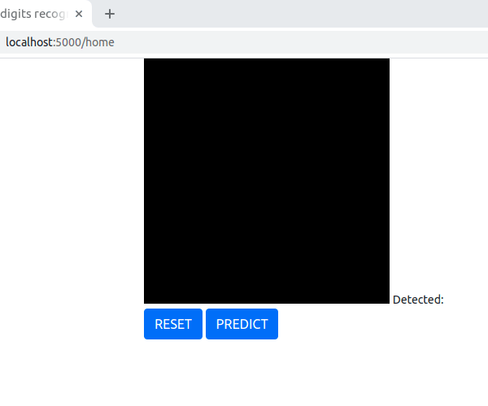

# Handwritten digit Captcha 
* Objective : A simple solution for replacing traditional captcha with a handwritten digit recognition using deep learning model. 

* Solution : MNIST dataset is used to train a simple CNN based model, the model is then saved and further exposed as a REST api using Flask. With javascript code input image is obtained and processed.   

* Results : Test accuracy of 90% was obtained on MNIST dataset using the CNN based model.

* Run : `python main.py` to launch the application

> Sample output :
> 
> 
> 
> 
> 
